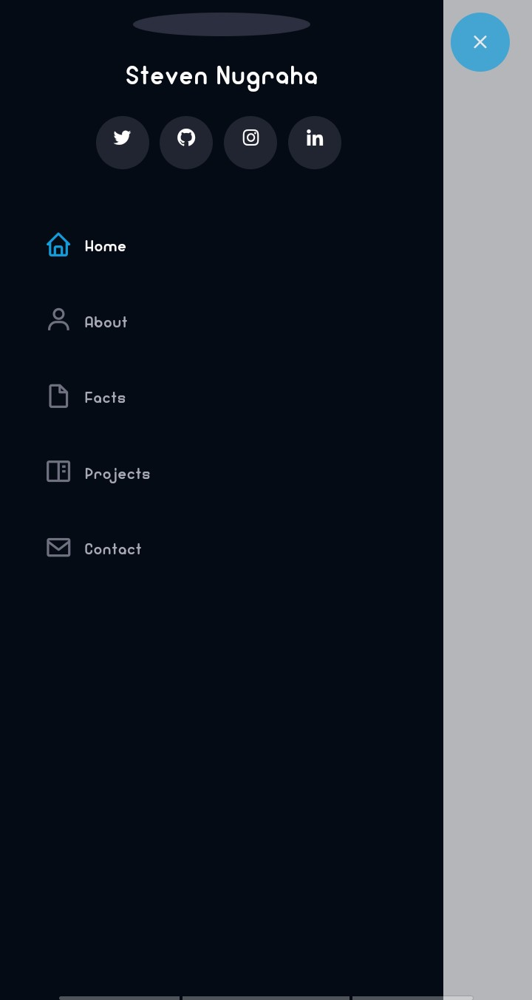
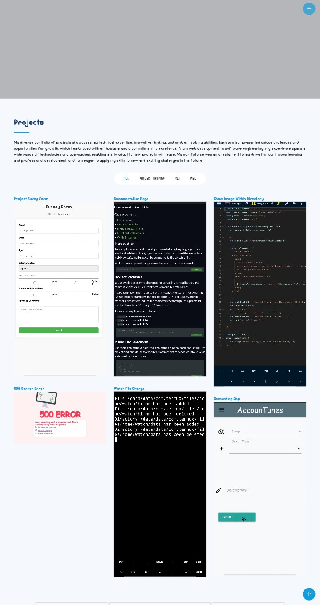

# 👉Welcome to My FreeCodeCamp Personal Portfolio 

This repository showcases my personal portfolio project, crafted as part of my FreeCodeCamp journey. Step inside and explore my skills, projects, and aspirations in the realm of web development!

## 👉Key Technologies and Libraries ️
- **Front-end Framework:** Bootstrap 5, providing a sleek and responsive foundation.
- **Iconography:** Boxicons, enhancing visual appeal with crisp icons.
- **Animations:** AOS (Animate On Scroll), creating engaging scroll-based effects.
- **Image Gallery:** glightbox, enabling seamless image viewing experiences.
- **Slider:** Swiper, gracefully presenting content in a carousel format.

## 💪Languages and Versions 

The portfolio is constructed using:

- **Markup:** HTML5, structuring the content and defining its meaning.
- **Styling:** CSS3, crafting the visual aesthetics and layout.
- **Interactivity:** JavaScript ES6, adding dynamic elements and user interactions.

## 👉Peek our creation
### Navigation:

## Main Page:

